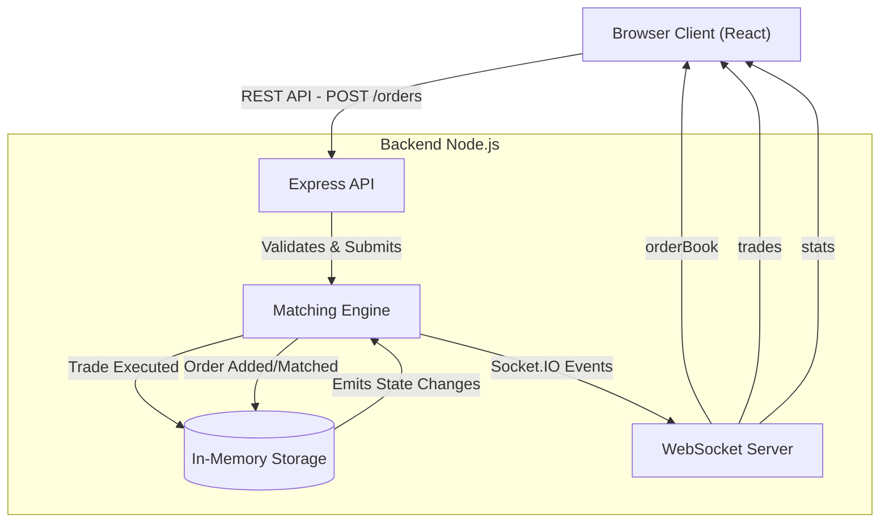

# Architecture Diagram

This document outlines the architecture for the ByteVox Simplified Exchange simulation.

## Flow of Data
1. **Order Submission:** User submits a form on the frontend, which sends a POST request to `/orders`.
2. **Order Matching:** The API validates the order and passes it to the Matching Engine.
3. **Execution:** The Matching Engine iterates through the opposing order book side to find overlapping prices. Trades are generated and executed immediately.
4. **Broadcast:** Once matching completes for a single request, the engine broadcasts the updated order book, new trades, and system stats to all connected WebSocket clients.
